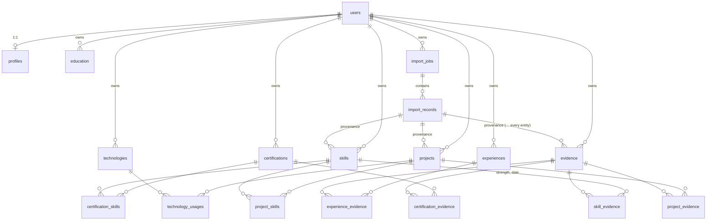

# PEOS Domain Model (Phase 1)

Source of truth: `prisma/schema.prisma`. Decisions: ADR 0003, ADR 0011–0014, ADR 0017.

## Entities

| Table            | Key fields                                                                                                                                          | Uniques                          | Indexes                                             |
| ---------------- | --------------------------------------------------------------------------------------------------------------------------------------------------- | -------------------------------- | --------------------------------------------------- |
| `profiles`       | headline, summary, location, website, professional_objective                                                                                        | `user_id`                        | `import_record_id`                                  |
| `experiences`    | organization*, title*, start_date*, end_date, description, achievements[]                                                                           | `(id,user_id)`                   | `(user_id,start_date)`                              |
| `education`      | institution*, degree, field_of_study, start/end, description, achievements[]                                                                        | —                                | `(user_id,start_date)`                              |
| `skills`         | name*, key*, category, description, level_model*, target_level, active                                                                              | `(id,user_id)`, `(user_id,key)`  | `(user_id,category)`                                |
| `technologies`   | name*, key*, category, version, notes                                                                                                               | `(id,user_id)`, `(user_id,key)`  | `(user_id,category)`                                |
| `certifications` | name*, issuer*, category, issue/expiry_date, credential_id, verification_url, status*                                                               | `(id,user_id)`                   | `(user_id,status)`, `(user_id,expiry_date)`         |
| `projects`       | name*, slug*, description, problem, solution, impact, status*, health_status*, start/target/completed dates, repository/demo/production URLs        | `(id,user_id)`, `(user_id,slug)` | `(user_id,status)`, `(user_id,updated_at)`          |
| `evidence`       | type*, title*, description, source_url, file_url, date, verified*, verified_at                                                                      | `(id,user_id)`                   | `(user_id,type)`, `(user_id,date)`                  |
| `import_jobs`    | source, file_name, file_size, file_sha256, parser_version, status, entity_hint, counts                                                              | `(id,user_id)`                   | `(user_id,created_at)`                              |
| `import_records` | entity_type, source_ref, payload (JSONB), validation__, confidence, match, matched_entity_id, review_status, decision, result_entity_id, reviewed__ | `(id,user_id)`                   | `(job_id,review_status)`, `(user_id,review_status)` |

`*` = NOT NULL. Every table has `id uuid`, `user_id uuid NOT NULL` (FK → users, cascade),
`created_at` and `updated_at timestamptz(3)`. Importable entities also have `origin` and
`import_record_id`.

**Join tables.** These are `project_skills`, `technology_usages(usage_type,
proficiency_evidence)`, `project_evidence`, `skill_evidence(strength, date)`,
`certification_skills`, `certification_evidence` and `experience_evidence`. Each has:

- `user_id`
- a composite primary key on the two parent ids
- a reverse index on the second parent
- **composite FKs `(parent_id, user_id)` to both parents**, which makes cross-user links
  impossible at the database level

## Integrity (SQL CHECKs in the migration)

- **Non-blank text:** organization, title, institution, names, issuer, evidence title.
- **Keys and slugs:** `key = lower(btrim(key))`; slug matches `^[a-z0-9]+(-[a-z0-9]+)*$` and is at
  most 80 characters.
- **Date order:** experience, education, certification issue/expiry, project target and completion
  dates.
- **Ranges:** `target_level` between 0 and 10; `level_model` not blank.
- **Verification:** `verified` ⇔ `verified_at` set.
- **Review queue:**
  - accepted ⇔ decision and result set
  - not pending ⇒ reviewed_at set
  - accepted ⇒ valid
  - duplicate ⇔ matched_entity_id set
- **Import jobs:** counts consistent and `file_sha256` is 64 hex characters.

## Ownership & provenance

- All reads and writes filter by `user_id` from the server session (ADR 0003, 0011).
- Provenance comes from `origin` + `import_record → import_job`. It covers source, file, sha256,
  parser version, importedAt, confidence, reviewedAt and reviewedBy, as `11` requires.

## Phase 3 additions

- **Milestone** (ADR 0022): `id`, `userId`, `projectId` (composite FK with the owner, cascade on project delete), `title`, `dueDate?`, `completedAt?`, `status` (planned · in_progress · blocked · completed · cancelled), timestamps. Check constraints: completed ⇔ completedAt; title not blank and at most 200 characters.
- **Computed project health** is derived on request and not stored (ADR 0023/0024). `Project.healthStatus` remains the manual assessment.

## Phase 4 additions

- **SkillLevelModel** (ADR 0026): `id`, `userId`, `name` (unique per user), `levels` (JSON array of exactly six entries `{value 0–5, label, description}`, CHECK-bounded). Skills reference it through `levelModel = "custom"` + `levelModelId` (composite FK with the owner, `NO ACTION`).
- **TechnologySkill** (ADR 0030): `userId`, `technologyId`, `skillId`, `createdAt`. Explicit user-maintained link; composite FKs to both owners; cascades.
- **Computed, never stored:** evidence-derived level (skill-level-v1), freshness (freshness-v1), demonstration trend (skill-trend-v1) and gap / critical gap (gap-analysis-v1).

## Phase 5 additions

- **Goal** (ADRs 0031–0033): `id`, `userId`, `parentId?` (composite self-FK with the owner, `NO ACTION`), `title`, `type` (north_star · annual_objective · quarterly_goal), `description?`, `outcome?`, `metric?`, `unit?`, `baseline?`, `target?` (finite floats), `startDate?`, `deadline?`, `status` (draft · active · on_hold · completed · cancelled, default draft), `completedAt?`, `confidence?` (low · medium · high, manual), timestamps. Checks: title not blank; completed ⇔ completedAt; deadline ≥ startDate; not its own parent. A parent is always a strictly higher level, so the hierarchy is acyclic and at most three levels deep.
- **GoalProject**, **GoalSkill**: `(goalId, projectId)` / `(goalId, skillId)` with `userId`; composite FKs to both owners; cascade.
- **GoalDependency**: `(goalId, dependsOnGoalId)` with `userId`; composite FKs; not self (check); acyclic (service).
- **GoalMeasurement**: `id`, `userId`, `goalId`, `date`, `value` (finite), `note?`, `createdAt`. Only recorded values; nothing is interpolated.
- **Milestone.goalId?** (ADR 0032): the goal a project milestone counts toward (Goal 1:N Milestone, `04`). Composite FK with the owner, `NO ACTION`; set only through `PUT /goals/:id/milestones`. Deleting a goal unlinks its milestones.
- **Computed, never stored:** overdue, target attainment (`goal-attainment-v1`), risk with its signals (`goal-risk-v1`), milestone progress, skill readiness (from Phase 4 skill intelligence).

## Phase 6 additions (AI Lab)

- **AIExperiment** (ADR 0036): `id`, `userId`, `projectId?` (optional composite FK, cascade),
  `title`, `hypothesis?`, `objective?`, `category?` (free text), `status` (planned · active ·
  completed · abandoned, default planned), `decision?` (adopt · reject · inconclusive; null =
  undecided), `result?`, `reproducibilityNote?`, `startedAt?`, `completedAt?`, timestamps. Checks:
  title not blank; `completedAt ≥ startedAt`.
- **ExperimentRun** (ADR 0037): `id`, `userId`, `experimentId`, `runNumber` (unique per
  experiment), `label?`, `status` (completed · failed · aborted), recorded config (`model`,
  `modelVersion`, `provider`, `promptVersion`, `datasetName`, `datasetVersion`, `codeRef`,
  `environment`), `runAt?`, and measured `costUsd?`, `latencyMs?`, `tokensInput?`,
  `tokensOutput?` (checks: runNumber ≥ 1; non-negative). Append-only history.
- **ExperimentMetric** (ADR 0038): `id`, `userId`, `runId`, `name`, `value` (finite), `unit?`,
  `higherIsBetter?` (null = no direction), `note?`. A recorded evaluation result.
- **ExperimentEvidence** (ADR 0038): `(experimentId, evidenceId)` with `userId`; reuses Evidence.
- Relationship **Project 1:N AIExperiment** (04). Composite FKs make cross-owner links impossible.
- **Computed, never stored:** reproducibility state (ADR 0039), run comparison and all analytics.
  PEOS never executes a model; measurements are user-recorded (ADR 0040).
